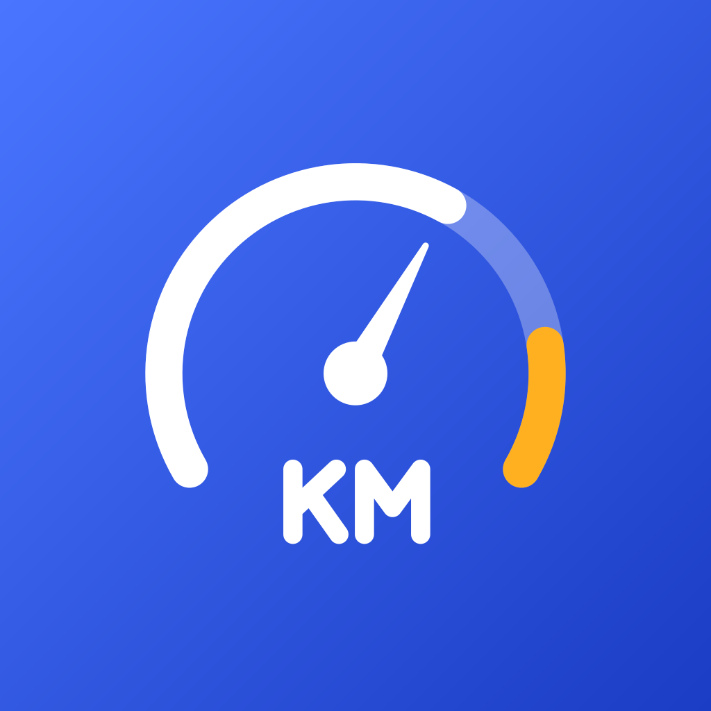
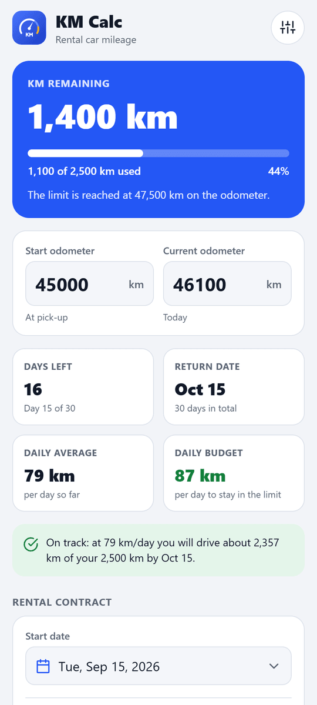
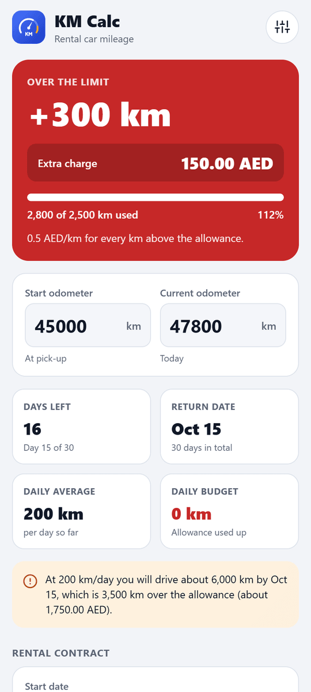
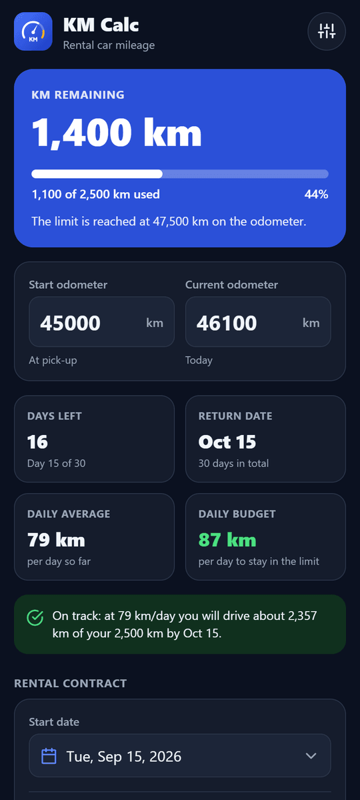
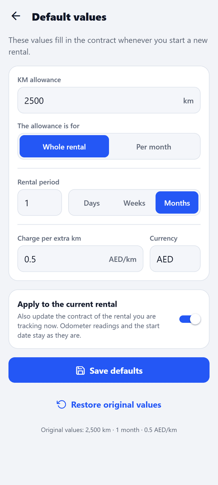

<p align="center">
  
</p>

<h1 align="center">KM Calc</h1>

<p align="center">
  Know how many kilometres you have left on your rental car, and what going over will cost.
</p>

<p align="center">
  <a href="https://github.com/Brahimhz/KmCalc/releases/latest"><b>Download for Android (APK)</b></a>
</p>

<p align="center">
  
  
  
  
</p>

## What it does

Enter the odometer reading from when you picked up the car, then save the odometer once a day. KM Calc shows:

- **KM remaining** in your allowance, with a progress bar and the odometer reading you must stay below.
- **Extra km and the extra charge** when you go over the allowance (0.5 AED per km by default).
- **Today compared with the daily allowance** (the allowance spread over the rental days, e.g. 2,500 km ÷ 30 days = 83.3 km/day): *+37 km (+44%) over* or *−23 km (−28%) under*.
- **Daily stats**: how many days you drove more than the allowance and by how many km (**+km, +%**), how many days less (**−km, −%**), and the overall balance.
- A **history** of the readings with each day's km and **+/−%**. Skipped a day? The km of the next reading are spread evenly over the days in between. Missed readings can be filled in later and wrong ones deleted.
- **Days left** and the return date, your **daily average** and a **daily budget** to stay within the limit.
- A **projection** of where your current pace takes you by the end of the rental, and when you would hit the limit.

Everything is saved on the phone. The app works offline and asks for no permissions.

### Default values (all editable)

| Setting | Default |
| --- | --- |
| KM allowance | 2,500 km |
| Rental period | 1 month (in days, weeks or months) |
| Charge per extra km | 0.5 |
| Currency | AED |

- Every value can be changed for the current rental on the main screen.
- To change the defaults themselves, tap the sliders icon (or **Edit** at the bottom). New rentals use them, and you can apply them to the current rental too. **Restore original values** brings back the values above.
- The allowance can be for the **whole rental** or **per day / week / month** (e.g. 2,500 km per month on a 3 month rental = 7,500 km).
- **Start a new rental** resets the readings and the contract to your defaults. Tick *Same car* when you renew, to continue from the current odometer.

## How it calculates

```text
used km          = latest reading − start odometer
allowance        = KM allowance (× rental length when it is per day / week / month)
km remaining     = allowance − used km
extra km         = used km − allowance          (when above the allowance)
extra charge     = extra km × charge per extra km
daily allowance  = allowance ÷ days in the rental
a day's +/− km   = km driven that day − daily allowance   (+/−% of the daily allowance)
daily budget     = km remaining ÷ days after the latest reading
projection       = daily average × days in the rental
```

A reading is the odometer at the end of its day, and the pick-up day is day 1.

## Install

- **Android (7.0 and newer):** download `KmCalc-vX.Y.Z.apk` from the [latest release](https://github.com/Brahimhz/KmCalc/releases/latest) and open it on your phone. Allow installing from your browser or files app when Android asks.
- **iPhone:** the app is written in React Native, so the same code runs on iOS. It needs a Mac with Xcode to build (see below) and is not published yet.

## Development

A plain [React Native](https://reactnative.dev) 0.87 app in TypeScript. The native projects are in `android/` (open it in Android Studio) and `ios/` (Xcode).

You need Node.js 22 or newer and [Android Studio](https://developer.android.com/studio) (Android SDK, emulator and the JDK it bundles). React Native needs to find them; on Windows (PowerShell):

```powershell
[Environment]::SetEnvironmentVariable('ANDROID_HOME', "$env:LOCALAPPDATA\Android\Sdk", 'User')
[Environment]::SetEnvironmentVariable('JAVA_HOME', 'C:\Program Files\Android\Android Studio\jbr', 'User')
```

Then, with an emulator running or a phone connected with USB debugging:

```bash
npm install
npm start          # Metro, the JavaScript dev server (keep it running)
npm run android    # in a second terminal: builds a debug app and opens it on the emulator/phone
npm test           # unit and UI tests (Jest + React Native Testing Library)
npm run check      # type check, lint and tests
```

In Android Studio, open the `android/` folder and use **Run** (start `npm start` first for debug builds).

For iOS, on a Mac: `bundle install`, `cd ios && bundle exec pod install`, then `npm run ios`.

```text
App.tsx            app shell: theme, saved data, screen switching
index.js           entry point
src/logic/         calculations (calc, dates, numbers): pure functions with unit tests
src/state/         rental form, defaults and on-device storage
src/screens/       Calculator and Default values screens
src/components/    fields, result card, calendar, icons, dialogs...
__tests__/         UI tests
android/, ios/     native projects
scripts/           icon generators
```

### Releasing the Android app

The release APK is built by GitHub Actions ([android.yml](.github/workflows/android.yml)); every push to `main` also builds one you can download from the run's artifacts.

1. Bump `versionCode` (always +1) and `versionName` in `android/app/build.gradle`. Keep `version` in `package.json` and `MARKETING_VERSION` / `CURRENT_PROJECT_VERSION` in `ios/KmCalc.xcodeproj/project.pbxproj` in step.
2. Push a version tag; the workflow attaches the APK to a new release:

   ```bash
   git tag v1.1.1
   git push origin v1.1.1
   ```

The APK is signed with the release key stored in the repository secrets `ANDROID_KEYSTORE_BASE64`, `ANDROID_KEYSTORE_PASSWORD` and `ANDROID_KEY_ALIAS` (it falls back to the debug key when they are missing, e.g. in forks). Keep a backup of the keystore: updates must be signed with the same key.

To build a signed release APK on your own machine, add the key to `~/.gradle/gradle.properties` (outside the repository):

```properties
KMCALC_STORE_FILE=C:/path/to/kmcalc-release.p12
KMCALC_STORE_PASSWORD=...
KMCALC_KEY_ALIAS=kmcalc
KMCALC_KEY_PASSWORD=...
```

and run `cd android && ./gradlew assembleRelease` (`gradlew.bat` on Windows). The APK is written to `android/app/build/outputs/apk/release/`.

### Icons

The app icons are drawn by [scripts/generate-icons.js](scripts/generate-icons.js) and the UI icons ([Feather](https://feathericons.com), MIT) by [scripts/generate-ui-icons.js](scripts/generate-ui-icons.js). Both need `npm install --no-save sharp feather-icons` first.

## License

[MIT](LICENSE)
